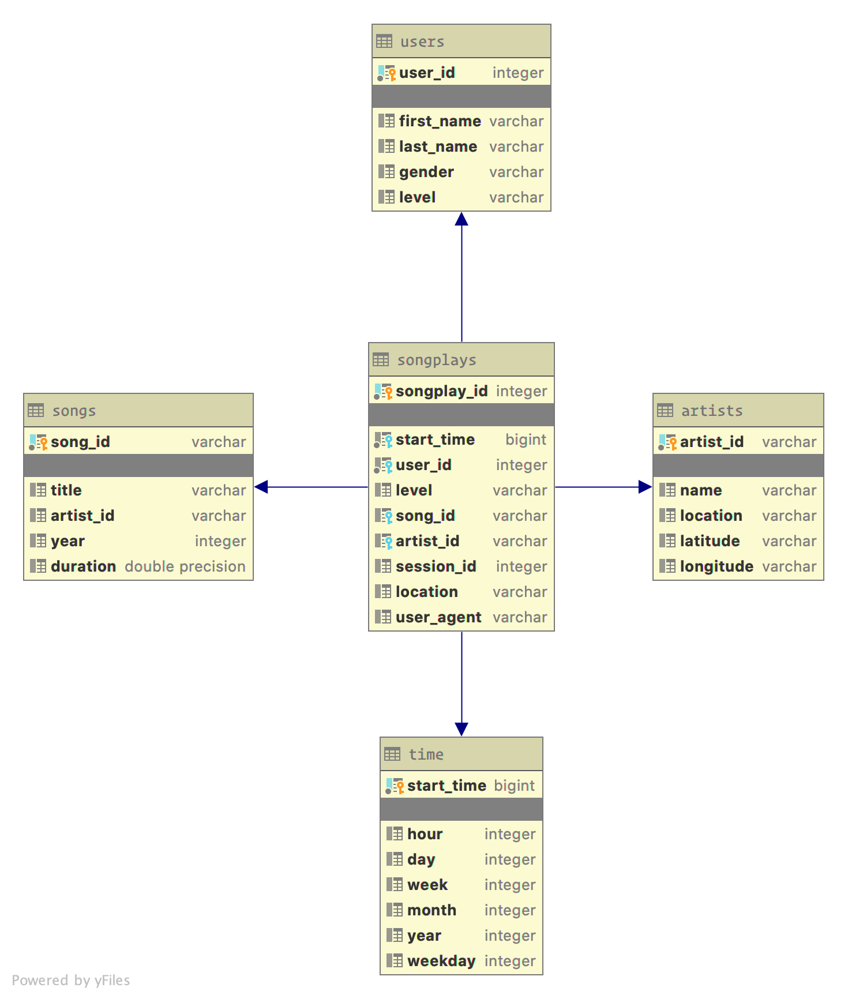

# Sparkify Example - Postgres

## Introduction

A startup called Sparkify wants to analyze the data they've been collecting on songs and user activity on their new music streaming app.
The analytics team is particularly interested in understanding what songs users are listening to.
Currently, they don't have an easy way to query their data, which resides in a directory of JSON logs on user activity on the app, as well as a directory with JSON metadata on the songs in their app.

## Running

To run the scripts locally, you will need access to an AWS Redshift cluster.
Fill out the credentials in `dwh.cfg` following the template. Make sure your cluster is in the us-west-2 region if you plan to use the given JSON data.

To create and populate the tables, run in the terminal:

```bash
python3 create_tables.py
python3 etl.py
```

## Project Structure

### Data

- `data/song_data` contains JSON files with song metadata (one JSON per song).
- `data/log_data` contains JSON logs of Sparkify's user activity, partitioned by year and month (one JSON per day).

### Code

- `test.ipynb` displays the first few rows of each table.
- `create_tables.py` drops and creates the tables.
- `etl.ipynb` demonstrates reading and processing a single file from `song_data` and `log_data` and loads the data into the tables.
- `etl.py` reads and processes files from `song_data` and `log_data` and loads them into the tables.
- `sql_queries.py` contains all sql queries, and is imported into the last three files above.

## Data model



### Star Schema

The data model uses the star schema optimized for queries on song play analysis.

#### Fact Table

- **songplays** - records in log data associated with song plays
  - songplay_id, start_time, user_id, level, song_id, artist_id, session_id, location, user_agent

#### Dimension Tables

- **user** - users in the app
  - user_id, first_name, last_name, gender, level
- **song** - songs in music database
  - song_id, title, artist_id, year, duration
- **artist** - artists in music database
  - artist_id, name, location, latitude, longitude
- **time** - timestamps of records in songplays broken down into specific units
  - start_time, hour, day, week, month, year, weekday

## ETL

The ETL pipeline is as follows:

1. Import data from JSON files stored in S3 into staging tables.
2. Import data from the staging tables into the target tables.

### Staging Tables

A staging table is a temporary table that holds all of the data that will be inserted into to a target table.
We use two staging tables that source the content table:

- **staging_events** - imports and holds the log JSON data, is used to populate **user**, **songplay** tables
- **staging_songs** - imports and holds the songs JSON data, is used to populate the **artist**, **song**, **songplay** target tables
